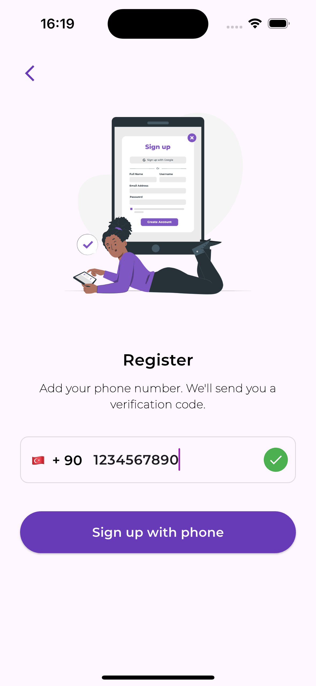
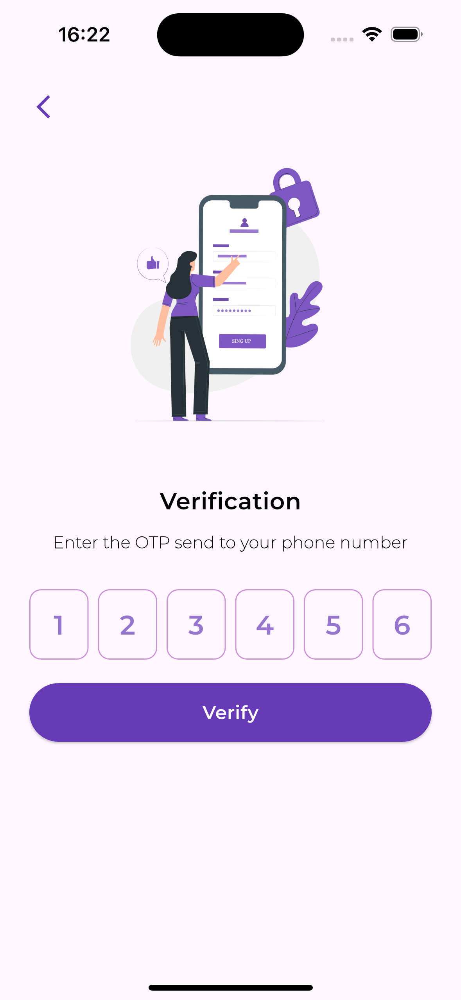
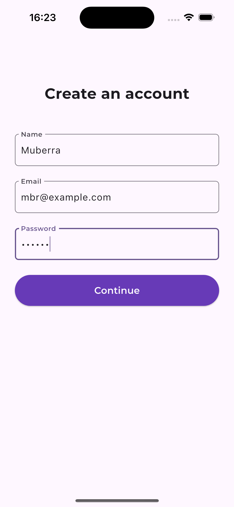
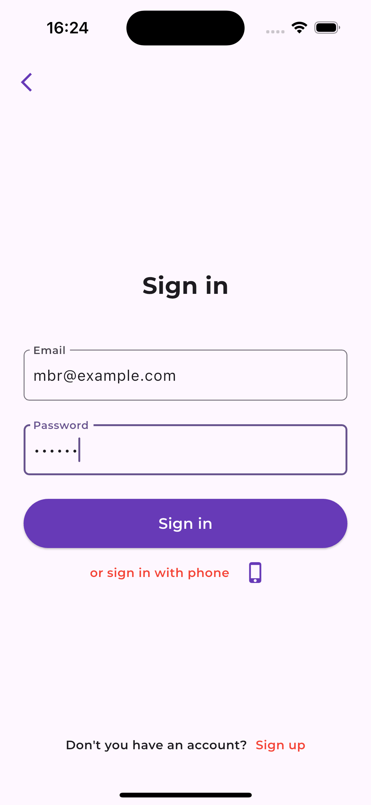

# Flutter Firebase Authentication App
A Flutter application that allows users to register and log in using phone code authentication and email. This project utilizes Firebase Authentication and Firestore services to securely manage user accounts and link their phone numbers with email addresses.

## Features
### Phone Code Authentication: 
Users can register using their phone numbers and receive a verification code, which is OTP, via SMS.
### Email and Password Login:
After registering their phone number, users can log in using the email address they provided.
### Firebase Integration
Utilizes Firebase Authentication and Firestore services to manage user data securely.
### User Interface
A user-friendly interface for registration and login processes.

## Technologies Used
### Flutter: 
Cross-platform UI toolkit for building natively compiled applications.
### Firebase Authentication: 
Securely manage user authentication and link phone numbers to email accounts.
### Firebase Firestore: 
Store user data and link their phone numbers and emails for easy login.
## Screenshots

| Welcome Screen | Registration | OTP Verification |
| --- | --- | --- |
|  |  |  |

| Create Account | Home Screen | Sign In |
| --- | --- | --- |
|  |  |  |

## Acknowledgements
- Special thanks to [Backslash Flutter](https://www.youtube.com/@backslashflutter) for their insightful tutorials on Flutter and Firebase. Their videos greatly assisted in understanding and implementing the authentication features in this project.

